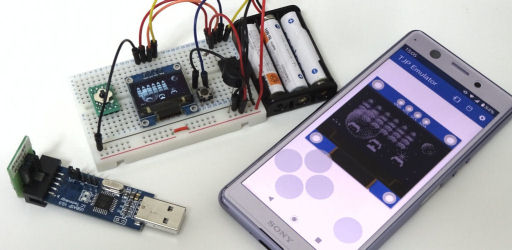

# TJPEmulator

This is an emulator of [TinyJoypad](https://www.tinyjoypad.com/tinyjoypad_attiny85) platform which is consisting of ATtiny85 and SSD1306.\
https://play.google.com/store/apps/details?id=com.obnsoft.tjpemu

This application is UNOFFICIAL and not licensed by anybody. So, DO NOT inquire of TinyJoypad founder about this. This comes with no warranties. This should be used at your own risk. The author of this has no responsibility.

## Features

* Load a HEX file.
* Load and save EEPROM data.
* Play sound.
* Control emulation speed.
* Capture a screen shot or a movie (saved as an animated GIF).

## Restrictions

* Very slow.
* Control of SSD1306 isn't perfect.

## Acknowledgement

### Libraries

 - [simavr](https://github.com/buserror/simavr)
 - [Red Hat elfutils](https://android.googlesource.com/platform/external/elfutils)

### Image resources

 - Some icons are generated by [無料素材サービス](https://sozai.cman.jp/).

## License

[GNU General Public License, Version 3.0](LICENSE)
